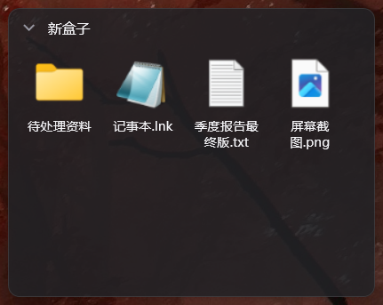
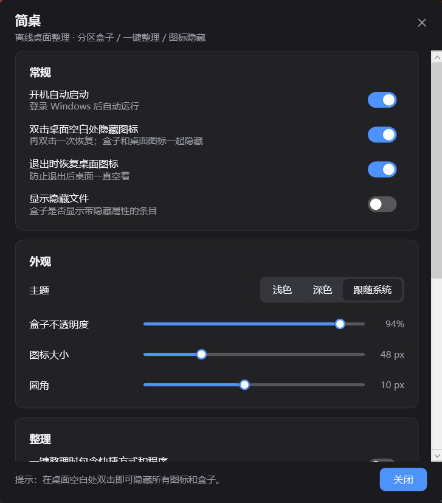

# 简桌（JianZhuo）

一个**完全离线**的 Windows 桌面整理工具：分区盒子、一键整理、双击隐藏图标、桌面右键菜单。
外观对标腾讯桌面整理的简洁风格，无账号、无同步、无壁纸、无遥测、无广告。

> 本项目是**净室实现**：只参考了公开的功能行为描述，没有使用任何反编译代码，不包含第三方专有代码。





## 功能

| 功能 | 说明 |
| --- | --- |
| 分区盒子 | 桌面上的悬浮面板，把文件按用途分组；可新建 / 重命名 / 移动 / 缩放 / 收起 / 锁定；支持图标与列表两种视图 |
| 一键整理 | **在设置窗口里点按钮执行**：按文件类型自动归类到「文档 / 图片 / 视频 / 音乐 / 压缩包 / 文件夹 / 其他」盒子，可一键撤销 |
| 图标隐藏 | 在桌面空白处**双击**即可隐藏全部桌面图标和盒子，再双击恢复 |
| 设置面板 | 一键整理 / 撤销整理 / 整理规则 / 主题外观 / 开机自启，都集中在这里 |
| 程序外壳 | 托盘图标、设置面板、开机自启 |

## 使用

1. 直接运行 `JianZhuo.exe`。首次启动会在桌面创建 `桌面整理` 文件夹和一个示例盒子。
2. 想自动归类时，打开**设置窗口**（托盘图标双击，或再运行一次 `JianZhuo.exe`），点最上面的**「一键整理桌面」**。
3. 平时也可以把桌面上想归类的东西**拖进盒子里**。
4. 在桌面空白处双击，可以隐藏所有图标专心看壁纸；再双击恢复。
5. 托盘右键 = 全部功能入口（一键整理 / 新建盒子 / 显示隐藏图标 / 设置 / 退出）。

### 关于桌面右键菜单

早期版本尝试把入口放进桌面右键菜单，现在去掉了，原因是 Windows 11 的**新版右键菜单只承载 COM 形式的 shell 扩展**：
同一个位置上的 `Open Git GUI here`、`在此处打开 Powershell 窗口`、`搜索 Everything...` 这些经典注册表项，在新菜单里同样看不到，
必须点「显示更多选项」才会出现。为了让功能开箱即用，主入口改由设置窗口承担。

旧版本写进注册表的菜单项会在启动时**自动清理**。

## 数据与安全

这是设计上最重要的一条：**盒子就是磁盘上的真实文件夹**，不含任何私有格式或数据库。

- 默认根目录：`%USERPROFILE%\Desktop\桌面整理\`
- 每个盒子 = 根目录下的一个文件夹；「解散盒子」会把里面的东西移回桌面，**不会删除文件**。
- 盒子内删除条目走的是**回收站**（`SHFileOperation` + `FOF_ALLOWUNDO`），不是永久删除。
- 「一键整理」会移动文件，但可以在设置里或右键菜单中**撤销上次整理**，会按移动日志原路搬回。
- 配置文件：`%APPDATA%\JianZhuo\config.json`（原子写入，写入前自动备份一份 `config.backup.json`，损坏时自动回退）。
- 日志：`%APPDATA%\JianZhuo\jianzhuo.log`
- 程序**不联网**，没有任何网络代码路径。

## 安装位置

程序是绿色单文件，不做安装。运行后涉及的位置：

| 内容 | 位置 |
| --- | --- |
| 主程序 | 你放它的地方，例如 `dist\JianZhuo.exe` |
| 配置与日志 | `%APPDATA%\JianZhuo\config.json`、`%APPDATA%\JianZhuo\jianzhuo.log` |
| 盒子文件夹 | 默认 `%USERPROFILE%\Desktop\桌面整理\` |
| 开机自启（开启时） | `HKCU\Software\Microsoft\Windows\CurrentVersion\Run` 下的 `JianZhuo` |

卸载 = 删除 exe + 删除 `%APPDATA%\JianZhuo` + 在设置里关掉开机自启。除此之外不写任何系统位置。

## 构建

需要 .NET 8 SDK（Windows）。

```powershell
# 生成多尺寸图标（只需一次，产物是二进制文件所以没有入库）
pwsh -File tools/make-icon.ps1

cd src/JianZhuo
dotnet build -c Release

# 打成单文件绿色版
dotnet publish -c Release -r win-x64 --self-contained true `
  -p:PublishSingleFile=true -p:IncludeNativeLibrariesForSelfExtract=true -o ../../dist
```

## 自检

一键整理涉及真实文件移动，所以内置了一套离线自检（在临时目录里跑，不碰真实桌面）：

```powershell
JianZhuo.exe --selftest
# 结果写到 %TEMP%\jianzhuo-selftest.txt
```

覆盖：类型归类、快捷方式与程序不自动整理、移动落位、撤销还原、重名自动加后缀、文件名清洗、桌面图标视图定位、配置序列化往返。

## 命令行

```text
JianZhuo.exe                       启动（已有实例则唤出设置）
JianZhuo.exe --action=organize     一键整理
JianZhuo.exe --action=newbox       新建盒子
JianZhuo.exe --action=toggleicons  显示 / 隐藏桌面图标
JianZhuo.exe --action=undo         撤销上次整理
JianZhuo.exe --action=settings     打开设置
JianZhuo.exe --action=addto --paths="文件路径"   把文件加入某个盒子
JianZhuo.exe --action=exit         退出
JianZhuo.exe --startup             开机自启时使用（不弹窗）
```

## 实现要点

- WPF（.NET 8），每个盒子是一个无边框分层窗口，被压到 z 序最底层，因此常驻桌面之上、始终位于普通窗口之下，也不需要注入 explorer。
- 图标用 `IShellItemImageFactory` 取高清图标；Shell 返回 `E_PENDING` 时会自动重试。
- 桌面图标显隐走资源管理器自己的菜单命令（`WM_COMMAND 0x7402`）发给 `SHELLDLL_DefView`，不改坏系统设置。
- 双击检测用低级鼠标钩子 + UI Automation 命中判断，确保双击图标时不会误触发。

## 已知限制

- 不支持多显示器之间按显示器分别记忆（位置按虚拟桌面坐标保存，改变显示器布局后需要重新摆一下）。
- 桌面图标隐藏用的是系统开关，属于全局状态：退出时默认会恢复（可在设置里关掉）。
- 没有磁盘映射和全盘搜索，这两个功能按需求排除在外。
